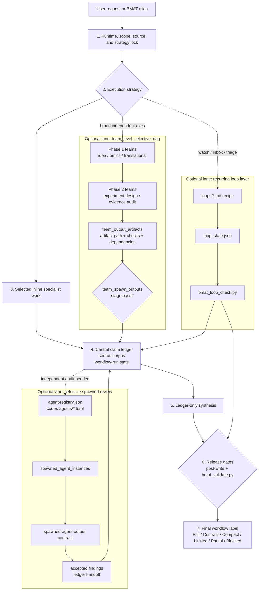

# BMAT for Codex

Codex Desktop marketplace package for the Biomedical Agent Teams (BMAT) plugin.

Current plugin version: `0.8.8`.

## Install

Clone this repository, then register the local marketplace path from Windows
PowerShell, macOS, or Linux:

```bash
git clone https://github.com/kdh-isaac/BMAT-for-codex.git
codex plugin marketplace add "<path-to-clone>"
codex plugin add biomedical-agent-teams@biomedical-agent-teams-marketplace
```

The plugin body is in `plugins/biomedical-agent-teams/` and exposes the
`biomedical-agent-teams` skill with 36 agent prompts, 6 command recipes, 14
contract schemas, 14 templates, 10 references, 4 loop recipes, 12 Codex reviewer
templates, a lightweight lazy-loaded router, source/result/claim integration,
tool-use honesty checks, compute-budget and team-DAG surfaces, loop-state
validation, deterministic artifact validators, and golden-case eval gates for
PMID drift, contradiction, overclaim, runtime mismatch, and ranking honesty.

## Workflow Structure



The main workflow progresses vertically from request lock to final label. The
lead owns the lock, selected inline work, claim ledger, workflow-run state, and
final synthesis. Optional lanes run only when the strategy calls for them, then
feed evidence back into the ledger: team DAG outputs are proven by
`team_output_artifacts`, reviewer execution is proven by
`spawned_agent_instances`, and recurring loops are checked by
`bmat_loop_check.py`. Full-protocol release requires the post-write validator
and `bmat_validate.py` to pass against the complete artifact bundle.

## Contents

- `.agents/plugins/marketplace.json`: local marketplace metadata.
- `plugins/biomedical-agent-teams/`: Codex plugin body.
- `plugins/biomedical-agent-teams/skills/biomedical-agent-teams/`: skill
  router, agents, commands, contracts, templates, references, loops, tests, and
  validators.

## Release Surface

Version `0.8.8` is the only supported release surface in this repository. Old
version changelog blocks and workspace-specific install paths have been removed
from the runtime docs; historical behavior is covered by tests and git history.

## Validation

The 0.8.8 package is validated with:

```bash
python plugins/biomedical-agent-teams/skills/biomedical-agent-teams/scripts/bmat_package_check.py --root plugins/biomedical-agent-teams
python plugins/biomedical-agent-teams/skills/biomedical-agent-teams/scripts/bmat_selftest.py --root plugins/biomedical-agent-teams
uvx --with jsonschema pytest tests plugins/biomedical-agent-teams/skills/biomedical-agent-teams/tests -q
python plugins/biomedical-agent-teams/skills/biomedical-agent-teams/evals/validate_golden_eval_schema.py --tasks plugins/biomedical-agent-teams/skills/biomedical-agent-teams/evals/golden_tasks.jsonl --outputs plugins/biomedical-agent-teams/skills/biomedical-agent-teams/evals/sample_outputs.jsonl
python plugins/biomedical-agent-teams/skills/biomedical-agent-teams/evals/run_golden_eval.py --tasks plugins/biomedical-agent-teams/skills/biomedical-agent-teams/evals/golden_tasks.jsonl --outputs plugins/biomedical-agent-teams/skills/biomedical-agent-teams/evals/sample_outputs.jsonl --strict --gate
```
