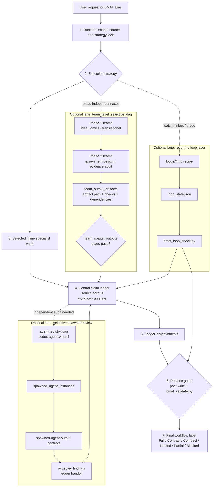

# BMAT for Codex

Codex Desktop marketplace package for the Biomedical Agent Teams (BMAT)
plugin.

Current plugin version: `1.0.0`.

## What This Package Is

BMAT is a Codex-native biomedical workflow router. It is not a collection of
always-running agents. Codex loads `SKILL.md` as a lightweight router, then the
selected command recipe loads only the required references, templates,
contracts, scripts, and role prompts.

The package supports biomedical evidence audits, public-omics planning and
execution, hypothesis tournaments, experiment design, translational scouting,
recurring loop checks, tool/result ledgers, workflow DAGs, and validator-backed
artifact bundles.

## Current 1.0.0 Surface

- Plugin metadata: `plugins/biomedical-agent-teams/.codex-plugin/plugin.json`
- Skill router: `plugins/biomedical-agent-teams/skills/biomedical-agent-teams/SKILL.md`
- Version file: `plugins/biomedical-agent-teams/skills/biomedical-agent-teams/VERSION`
- Resource manifest: `plugins/biomedical-agent-teams/skills/biomedical-agent-teams/source-manifest.json`

Current resource counts:

| Resource | Count |
| --- | ---: |
| Agent role prompts | 36 |
| Command recipes | 6 |
| Contract schemas | 17 |
| Templates | 15 |
| Markdown references | 10 |
| JSON references | 1 |
| Loop recipes | 4 |
| Codex reviewer TOML templates | 12 |
| Workflow DAGs | 6 |
| Domain packs | 2 |
| Package scripts | 9 |
| Eval scripts | 3 |
| Test modules | 9 |

## Install

Clone this repository, then register the local marketplace path:

```bash
git clone https://github.com/kdh-isaac/BMAT-for-codex.git
codex plugin marketplace add "<path-to-clone>"
codex plugin add biomedical-agent-teams@biomedical-agent-teams-marketplace
```

Check the live install surface:

```bash
codex plugin list
codex debug prompt-input
```

After install, the prompt surface should expose:

```text
biomedical-agent-teams:biomedical-agent-teams
```

and the installed cache should resolve under:

```text
~/.codex/plugins/cache/biomedical-agent-teams-marketplace/biomedical-agent-teams/1.0.0
```

## Primary Aliases

| Alias | Use for |
| --- | --- |
| `biomedical-research-council` | Broad research coordination, mechanism review, writing support, or multi-lane audit |
| `idea-discovery-team` | Hypothesis generation, ranking, tournament design, and idea triage |
| `omics-analysis-team` | Public omics discovery, QC, reproducible analysis, provenance, and analysis planning |
| `evidence-audit-team` | Citation, PMID, source-corpus, contradiction, overclaim, and final-claim audit |
| `experiment-design-team` | Wet-lab or in vivo experiment design, controls, confounders, reagent/logistics planning, and statistics |
| `translational-scout-team` | Clinical trial, regulatory, IP, commercial, and translational scouting |

## Workflow Structure



The lead owns the runtime lock, selected inline work, central claim ledger,
workflow-run state, and final synthesis. Optional team, reviewer, and loop lanes
run only when selected by the execution strategy, then hand evidence back to the
ledger. Full-protocol release requires a complete artifact bundle plus a passing
validator gate.

## Full Protocol Contract

`Full protocol followed` is a validator-backed bundle label, not a prose quality
claim. A full-protocol run must include:

- `run_state.json`
- `runtime_capability_preflight.json`
- `source_corpus.json`
- `claim_ledger.json`
- `stage_evaluation.json`
- `post_write_validation.json`
- non-empty `final.md`

When applicable, the bundle also includes:

- `workflow_dag.json`
- `results_integration.json`
- `tool_call_ledger.json`

The validator checks required artifact presence, passing required stages,
post-write verdict, independent review evidence, source-backed claim references,
final wording drift, high-confidence S3 gates, results integration, tool-ledger
honesty, and workflow DAG alias/mode/id consistency.

## 1.0.0 Highlights

- Canonical runtime artifact bundle centered on
  `runtime_capability_preflight.json`.
- Tool-use honesty through `tool_call_ledger.json` and
  `bmat_tool_ledger_check.py`.
- Results-to-source-to-claim reconciliation through
  `results_integration.json`.
- Six alias-specific workflow DAGs under `workflows/*.json`.
- `bmat_run.py` local runner with DAG mode/id normalization, validator wrapping,
  and Markdown workbench export.
- Full-protocol gate enforcement for independent review and complete
  `spawned_agent_instances` records.
- Golden eval gates for PMID drift, contradiction, overclaim,
  tournament-loop, tournament-ranking, Codex-runtime, and semantic-scope cases.
- BOM-free release surface and source/cache parity checks.

## Validation

The 1.0.0 package is validated from the repository or marketplace root with:

```bash
python plugins/biomedical-agent-teams/skills/biomedical-agent-teams/scripts/bmat_package_check.py --root plugins/biomedical-agent-teams
python plugins/biomedical-agent-teams/skills/biomedical-agent-teams/scripts/bmat_selftest.py --root plugins/biomedical-agent-teams
python plugins/biomedical-agent-teams/skills/biomedical-agent-teams/evals/validate_golden_eval_schema.py --tasks plugins/biomedical-agent-teams/skills/biomedical-agent-teams/evals/golden_tasks.jsonl --outputs plugins/biomedical-agent-teams/skills/biomedical-agent-teams/evals/sample_outputs.jsonl
python plugins/biomedical-agent-teams/skills/biomedical-agent-teams/evals/run_golden_eval.py --tasks plugins/biomedical-agent-teams/skills/biomedical-agent-teams/evals/golden_tasks.jsonl --outputs plugins/biomedical-agent-teams/skills/biomedical-agent-teams/evals/sample_outputs.jsonl --strict --gate
python plugins/biomedical-agent-teams/skills/biomedical-agent-teams/evals/run_model_golden_eval.py --tasks plugins/biomedical-agent-teams/skills/biomedical-agent-teams/evals/golden_tasks.jsonl --alias evidence-audit-team --runtime codex --model sample-model --out /tmp/bmat-model-sample.jsonl --sample-mode --then-score --gate
uvx --with jsonschema pytest tests plugins/biomedical-agent-teams/skills/biomedical-agent-teams/tests -q
```

For real model-in-the-loop evaluation, replace `--sample-mode` with an explicit
`--adapter-command` that reads one golden task JSON object from stdin and writes
one scorer-compatible JSON object to stdout. CI should keep using sample mode.

## Maintenance Rule

Treat the source tree, installed cache, prompt surface, package metadata,
manifest counts, README text, generated bundle commands, and validator tests as
one release surface. Do not rely on README text alone to establish plugin truth.
