# BMAT for Codex

Codex Desktop marketplace package for the Biomedical Agent Teams (BMAT)
plugin.

Current plugin version: `1.1.0`.

## What This Package Is

BMAT is a Codex-native biomedical workflow router. It is not a collection of
always-running agents. Codex loads `SKILL.md` as a lightweight router, then the
selected command recipe loads only the required references, templates,
contracts, scripts, and role prompts.

The package supports biomedical evidence audits, public-omics planning and
execution, hypothesis tournaments, experiment design, translational scouting,
recurring loop checks, tool/result ledgers, workflow DAGs, and validator-backed
artifact bundles.

The current 1.1.0 contract layer adds `lead_decision.json`, 10x/bulk
`omics_run_manifest.json` v2, `--tier compact|full`, omics `--track` subtracks,
validator JSON `fix_hint`, privacy/security tool-ledger fields, 10x/bulk golden
tasks, a local Codex adapter scaffold, a public-omics benchmark smoke harness,
and an `immuno-oncology` domain pack.

## Current 1.1.0 Surface

- Plugin metadata: `plugins/biomedical-agent-teams/.codex-plugin/plugin.json`
- Skill router: `plugins/biomedical-agent-teams/skills/biomedical-agent-teams/SKILL.md`
- Version file: `plugins/biomedical-agent-teams/skills/biomedical-agent-teams/VERSION`
- Resource manifest: `plugins/biomedical-agent-teams/skills/biomedical-agent-teams/source-manifest.json`

Current resource counts:

| Resource | Count |
| --- | ---: |
| Agent role prompts | 38 |
| Command recipes | 6 |
| Contract schemas | 18 |
| Templates | 16 |
| Markdown references | 10 |
| JSON references | 1 |
| Loop recipes | 4 |
| Codex reviewer TOML templates | 14 |
| Workflow DAGs | 6 |
| Domain packs | 3 |
| Package scripts | 11 |
| Eval scripts | 3 |
| Test modules | 10 |

## Install

Recommended: register the GitHub-hosted marketplace, then install from the
Codex plugin browser:

```bash
codex plugin marketplace add kdh-isaac/BMAT-for-codex --ref main
codex
```

In Codex, open the plugin browser:

```text
/plugins
```

Find **Biomedical Agent Teams** under the
`biomedical-agent-teams-marketplace` marketplace and choose **Install plugin**.

Developer fallback: clone the repository and register the local marketplace
path when testing unpublished changes:

```bash
git clone https://github.com/kdh-isaac/BMAT-for-codex.git
cd BMAT-for-codex
codex plugin marketplace add .
codex
```

Then open `/plugins` and install **Biomedical Agent Teams** from the local
marketplace entry.

After installation, the prompt surface should expose:

```text
biomedical-agent-teams:biomedical-agent-teams
```

and the installed cache should resolve under:

```text
~/.codex/plugins/cache/biomedical-agent-teams-marketplace/biomedical-agent-teams/1.1.0
```

## Primary Aliases

| Alias | Use for |
| --- | --- |
| `biomedical-research-council` | Broad research coordination, mechanism review, writing support, or multi-lane audit |
| `idea-discovery-team` | Hypothesis generation, ranking, tournament design, and idea triage |
| `omics-analysis-team` | Public omics discovery, QC, reproducible analysis, provenance, and analysis planning |
| `evidence-audit-team` | Citation, PMID, source-corpus, contradiction, overclaim, and final-claim audit |
| `experiment-design-team` | Wet-lab or in vivo experiment design, controls, confounders, reagent/logistics planning, and statistics |
| `translational-scout-team` | Clinical trial, regulatory, IP, commercial, and translational scouting |

## Workflow Structure

```mermaid
flowchart TD
    accTitle: BMAT v1.1.0 Workflow Structure
    accDescr: Full package workflow from Codex routing through command DAGs, optional team, reviewer, tool, and loop lanes, artifact bundle creation, validation gates, and final label selection.

    request["1. User request<br/>or explicit BMAT alias"]
    router["2. SKILL.md lightweight router<br/>selects one command recipe"]
    recipe["3. Command recipe<br/>loads only required agents,<br/>references, templates, contracts, scripts"]
    preflight["4. Runtime, scope, source, and strategy lock<br/>mode, scope, source needs,<br/>tools, file/write, web, spawn support"]
    strategy{"5. Execution strategy"}

    request --> router --> recipe --> preflight --> strategy

    strategy --> inline["inline_first_selective_review<br/>default lead-controlled workflow"]
    strategy -. "only for broad independent axes" .-> team_lane
    strategy -. "only for watch / inbox / recurrence" .-> loop_lane

    inline --> dag_select{"6. Alias-specific workflow DAG"}

    subgraph dag_catalog["Canonical command DAGs in workflows/*.json"]
        direction TB
        brc["biomedical-research-council<br/>S0 context lock<br/>S1 source lock<br/>S2 claim graph<br/>S3 evidence review<br/>S4 write + validate"]
        idea["idea-discovery-team<br/>S0 context lock<br/>S1 generate hypotheses<br/>S2 rank hypotheses<br/>S3 confounder critique<br/>S4 post-write validate"]
        omics["omics-analysis-team<br/>S0 context lock<br/>S1 plan / curate data<br/>S2 execute analysis<br/>S3 stats validation<br/>S4 code review<br/>S5 post-write validate"]
        audit["evidence-audit-team<br/>S0 context lock<br/>S1 source corpus<br/>S2 claim ledger<br/>S3 citation check<br/>S4 contradiction check<br/>S5 post-write validate"]
        design["experiment-design-team<br/>S0 context lock<br/>S1 design plan<br/>S2 statistics plan<br/>S3 claim lock<br/>S4 post-write validate"]
        scout["translational-scout-team<br/>S0 context lock<br/>S1 clinical / trial sources<br/>S2 IP + regulatory<br/>S3 safety review<br/>S4 post-write validate"]
    end

    dag_select --> brc
    dag_select --> idea
    dag_select --> omics
    dag_select --> audit
    dag_select --> design
    dag_select --> scout

    subgraph team_lane["Optional team_level_selective_dag lane"]
        direction TB
        team_plan["team_spawn_plan<br/>dependency-aware lane selection"]
        team_outputs["team_output_artifacts<br/>artifact path, checks, dependencies"]
        team_record["run_state team_spawn_lanes<br/>and stage handoff"]
        team_plan --> team_outputs --> team_record
    end

    subgraph reviewer_lane["Optional selective spawned review lane"]
        direction TB
        registry["agent-registry.json<br/>codex-agents/*.toml"]
        spawned["spawned_agent_instances<br/>role, task, status, output_artifact"]
        review_contract["spawned-agent-output contract<br/>findings, confidence, checks"]
        review_handoff["accepted findings<br/>merged back into claim ledger"]
        registry --> spawned --> review_contract --> review_handoff
    end

    subgraph tool_lane["Tool and result honesty lane"]
        direction TB
        tool_calls["tool_call_ledger.json<br/>success / skipped / unavailable / blocked / failed"]
        result_map["results_integration.json<br/>source -> result -> claim mapping"]
        tool_check["bmat_tool_ledger_check.py<br/>registered tools and downgrade reasons"]
        tool_calls --> result_map --> tool_check
    end

    subgraph loop_lane["Optional recurring loop lane"]
        direction TB
        loop_recipe["loops/*.md recipe"]
        loop_state["loop_state.json"]
        loop_check["bmat_loop_check.py<br/>freshness, connector, objection,<br/>release-artifact policy"]
        loop_recipe --> loop_state --> loop_check
    end

    brc --> bundle
    idea --> bundle
    omics --> bundle
    audit --> bundle
    design --> bundle
    scout --> bundle
    team_record --> bundle
    review_handoff --> bundle
    tool_check --> bundle
    loop_check --> bundle
    bundle -. "independent review required by recipe or label" .-> registry

    bundle["7. Canonical artifact bundle<br/>run_state.json<br/>runtime_capability_preflight.json<br/>source_corpus.json<br/>claim_ledger.json<br/>stage_evaluation.json<br/>post_write_validation.json<br/>final.md"]
    extras["Policy-checked extras<br/>lead_decision.json<br/>workflow_dag.json<br/>results_integration.json<br/>tool_call_ledger.json<br/>omics_run_manifest.json"]
    gates{"8. Release gates"}
    postwrite["post-write-final-validator<br/>final wording and limitation check"]
    validate["bmat_validate.py<br/>bundle schema + policy gate<br/>source-backed claims, DAG consistency,<br/>independent review, final wording"]
    label{"9. Strongest allowed final label"}

    bundle --> extras --> gates
    gates --> postwrite --> validate --> label

    label --> full["Full protocol followed"]
    label --> contract["Contract-shaped artifact bundle"]
    label --> compact["Compact standard workflow"]
    label --> narrative["BMAT-informed narrative review"]
    label --> limited["Limited capability-downgraded workflow"]
    label --> partial["Partial workflow; formal gates skipped"]
    label --> blocked["Blocked"]
```



The lead owns the router decision, runtime preflight, selected command DAG,
central claim ledger, artifact bundle, and final synthesis. Team, reviewer,
tool/result, and recurring-loop lanes run only when the selected recipe,
execution strategy, risk class, or requested label requires them. Full-protocol
release is allowed only after the complete bundle and policy-checked optional
artifacts satisfy the post-write and validator gates.

## Full Protocol Contract

`Full protocol followed` is a validator-backed bundle label, not a prose quality
claim. A full-protocol run must include:

- `run_state.json`
- `runtime_capability_preflight.json`
- `lead_decision.json`
- `source_corpus.json`
- `claim_ledger.json`
- `stage_evaluation.json`
- `post_write_validation.json`
- non-empty `final.md`

When applicable, the bundle also includes:

- `workflow_dag.json`
- `results_integration.json`
- `tool_call_ledger.json`
- `omics_run_manifest.json`

The validator checks required artifact presence, passing required stages,
post-write verdict, independent review evidence, source-backed claim references,
lead-decision hard gates, omics manifest v2 requirements, final wording drift,
high-confidence S3 gates, results integration, privacy-aware tool-ledger
honesty, and workflow DAG alias/mode/id/track consistency.

## 1.1.0 Highlights

- `lead_decision.json` is a validator-enforced routing artifact for
  source-backed `standard`, `deep`, `audit`, `team_level_selective_dag`, and
  `Full protocol followed` runs.
- `omics_run_manifest.json` v2 contracts 10x Cell Ranger, CellPlex,
  CITE-seq, V(D)J, multiome, and bulk RNA-seq provenance with required QC,
  biological-unit, pseudobulk/design, and review fields.
- `bmat_run.py` and `bmat_codex_adapter.py` support `--tier compact|full` and
  omics `--track` values, and now keep `workflow_dag.json` aligned with the
  selected omics track.
- `bmat_validate.py` emits machine-readable `fix_hint` guidance and blocks
  workflow DAG alias/mode/id/track drift.
- `tool_call_ledger.json` includes execution-governance fields for data class,
  query redaction, approval reference, runtime surface, artifact hash,
  retention policy, network boundary, and PII risk.
- Golden eval coverage is 36 tasks, including 10x provenance/QC/statistics,
  bulk RNA-seq provenance/design/FDR, privacy, and Codex-runtime cases.
- The public omics benchmark smoke harness covers 9 metadata-only public cases:
  10x PBMC GEX, GEO 10x/CellPlex/bulk cases, CITE-seq, V(D)J, and multiome.
- Domain packs include `generic-biomedical`, `cell-therapy`, and
  `immuno-oncology`.
- Release tests check BOM-free text surfaces, legacy-version residue, source
  manifest coverage, and source/cache parity.

## Latest Local Verification

The local source and installed cache were rechecked on 2026-07-07 KST after the
latest workflow-DAG track patch:

| Check | Result |
| --- | --- |
| Source vs installed cache `diff -qr` | clean |
| `codex plugin list` | `biomedical-agent-teams` `1.1.0` installed, enabled |
| `codex debug prompt-input` | `biomedical-agent-teams/1.1.0/.../SKILL.md` visible |
| Targeted pytest suite | `115 passed` |
| Full pytest suite | `200 passed` |
| Package check and self-test | passed |
| Golden schema and strict golden gate | passed |
| Model golden sample gate | passed |
| Public omics benchmark smoke | 9/9 bundles passed; no raw data downloaded |
| Adapter dry-run smoke | validator exit 0 with expected compact-reviewer downgrade warning |
| Bytecode/test-cache residue under source and installed cache | none found |

## Validation

The 1.1.0 package is validated from the repository or marketplace root with:

```bash
python plugins/biomedical-agent-teams/skills/biomedical-agent-teams/scripts/bmat_package_check.py --root plugins/biomedical-agent-teams
python plugins/biomedical-agent-teams/skills/biomedical-agent-teams/scripts/bmat_selftest.py --root plugins/biomedical-agent-teams
python plugins/biomedical-agent-teams/skills/biomedical-agent-teams/evals/validate_golden_eval_schema.py --tasks plugins/biomedical-agent-teams/skills/biomedical-agent-teams/evals/golden_tasks.jsonl --outputs plugins/biomedical-agent-teams/skills/biomedical-agent-teams/evals/sample_outputs.jsonl
python plugins/biomedical-agent-teams/skills/biomedical-agent-teams/evals/run_golden_eval.py --tasks plugins/biomedical-agent-teams/skills/biomedical-agent-teams/evals/golden_tasks.jsonl --outputs plugins/biomedical-agent-teams/skills/biomedical-agent-teams/evals/sample_outputs.jsonl --strict --gate
python plugins/biomedical-agent-teams/skills/biomedical-agent-teams/evals/run_model_golden_eval.py --tasks plugins/biomedical-agent-teams/skills/biomedical-agent-teams/evals/golden_tasks.jsonl --alias evidence-audit-team --runtime codex --model sample-model --out /tmp/bmat-model-sample.jsonl --sample-mode --then-score --gate
python plugins/biomedical-agent-teams/skills/biomedical-agent-teams/scripts/bmat_public_omics_benchmark_smoke.py --out /tmp/bmat-public-omics-benchmark --validate --force
uvx --with jsonschema pytest tests plugins/biomedical-agent-teams/skills/biomedical-agent-teams/tests -q
```

For real model-in-the-loop evaluation, replace `--sample-mode` with an explicit
`--adapter-command` that reads one golden task JSON object from stdin and writes
one scorer-compatible JSON object to stdout. CI should keep using sample mode.

## Maintenance Rule

Treat the source tree, installed cache, prompt surface, package metadata,
manifest counts, README text, generated bundle commands, and validator tests as
one release surface. Do not rely on README text alone to establish plugin truth.
