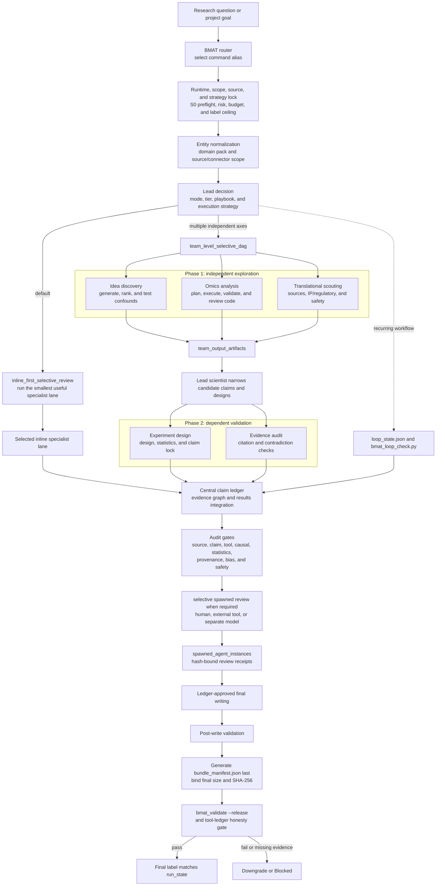

# BMAT for Codex

BMAT for Codex is a Codex-native biomedical workflow router with auditable,
validator-backed artifact bundles. Current release: `1.2.0`.

BMAT selects one command recipe, records runtime and evidence boundaries, and
coordinates only the specialist lanes needed for the request. It supports
evidence audits, public-omics planning, hypothesis tournaments, experiment
design, translational scouting, and recurring review loops. It does not certify
scientific truth or replace expert, statistical, ethics, clinical, or
regulatory review.

## Install

Register the GitHub marketplace and install the plugin from Codex:

```bash
codex plugin marketplace add kdh-isaac/BMAT-for-codex --ref main
codex
```

Open `/plugins`, find **Biomedical Agent Teams**, and choose **Install
plugin**. The installed prompt surface is:

```text
biomedical-agent-teams:biomedical-agent-teams
```

For local development:

```bash
git clone https://github.com/kdh-isaac/BMAT-for-codex.git
cd BMAT-for-codex
codex plugin marketplace add .
```

## Command aliases

| Alias | Primary use |
| --- | --- |
| `biomedical-research-council` | Broad biomedical coordination and multi-lane synthesis |
| `evidence-audit-team` | Source, citation, claim, contradiction, and overclaim audit |
| `omics-analysis-team` | Public omics discovery, QC, reproducible analysis, and provenance |
| `idea-discovery-team` | Hypothesis generation, blinded tournament, ranking, and triage |
| `experiment-design-team` | Controls, units, sample size, confounding, feasibility, and safety |
| `translational-scout-team` | Trial, regulatory, IP, operational, and translational scouting |

BMAT defaults to an inline lead-controlled workflow and adds selective reviewer
or team lanes only when the risk and dependency structure justify them.

## Workflow architecture

The lead scientist owns routing, merge decisions, the central claim ledger, and
final synthesis. `inline_first_selective_review` is the default. BMAT uses
`team_level_selective_dag` only when the request contains genuinely independent
decision axes with explicit dependencies and a single merge owner.



The authoritative command DAGs under `workflows/*.json` use these stage
sequences:

| Alias | Blocking DAG |
| --- | --- |
| `biomedical-research-council` | Context lock → source lock → claim graph → evidence review → post-write validation |
| `evidence-audit-team` | Context lock → source corpus → claim ledger → citation check → contradiction check → post-write validation |
| `omics-analysis-team` | Context lock → plan/manifest → execute → statistics and provenance validation → code review → post-write validation |
| `idea-discovery-team` | Context lock → hypothesis generation → blinded tournament ranking → confounder review → post-write validation |
| `experiment-design-team` | Context lock → design/controls/sample size → biostatistics review → claim lock → post-write validation |
| `translational-scout-team` | Context lock → clinical/source scouting → IP and regulatory analysis → safety/ethics review → post-write validation |

Every release path keeps source verification, claim support, tool calls, claim
changes, and eligible review receipts structurally separate. It generates the
bundle manifest only after reviewed artifacts are final, then applies the common
release validators. A passing process label does not certify scientific truth.

## What v1.2.0 hardens

- Strict v2 source, claim-support, review, experiment-design, tournament, and
  bundle-integrity contracts.
- Source verification that distinguishes live-tool, human, local-file,
  fixture, and not-checked modes. Fixture rows are never release-eligible.
- Claim support bound to source-owned evidence spans and seven scope axes.
- Hash-bound review receipts with author/reviewer runtime identity. Same-model
  self-review and same-model separate-context review are supplementary, not
  independent.
- A final `bundle_manifest.json` that binds release artifacts to their exact
  bytes, schema version, plugin version, and workflow run.
- Conservative v1-to-v2 migration that writes a new bundle and never invents
  verification, review identity, hashes, or scientific support.
- Cross-platform CI on Python 3.10-3.13, including Ubuntu full gates and
  Windows path/CLI checks.

## Validation model

BMAT reports five different layers separately:

1. process and contract validation;
2. source identity verification;
3. claim entailment and scope review;
4. receipt-backed independent review; and
5. scientific truth, which BMAT cannot certify.

`Full protocol followed` is a process label for a release-valid bundle. It is
not a truth claim. Sample-mode golden evaluation tests deterministic evaluator
wiring, and the public-omics smoke harness is metadata-only; neither evaluates
a live model or biological correctness.

See [validation boundaries](docs/validation-boundaries.md) for the exact
interpretation and fixture limitations.

## Release bundle

A release-bound full-protocol bundle contains the canonical workflow state,
preflight, lead decision, source corpus and verification, claim ledger and
support matrix, results/tool records, review manifest and runtime receipts,
post-write validation, final text, and the final bundle manifest. Workflow-
specific artifacts such as omics manifests, experiment design, or hypothesis
tournament are required when selected by the command DAG.

Generate the integrity manifest after the bundle is otherwise final:

```bash
python plugins/biomedical-agent-teams/skills/biomedical-agent-teams/scripts/bmat_bundle_manifest.py --bundle path/to/bundle
python plugins/biomedical-agent-teams/skills/biomedical-agent-teams/scripts/bmat_validate.py --bundle path/to/bundle --release
```

Changing a reviewed or manifested file makes the old receipt stale. Repeat the
affected review and regenerate the manifest.

## Clean-checkout validation

The supported release matrix is Python 3.10, 3.11, 3.12, and 3.13. The complete
copyable command sequence is in the
[release checklist](docs/release-checklist.md). The main gates are:

```bash
python plugins/biomedical-agent-teams/skills/biomedical-agent-teams/scripts/bmat_package_check.py --root plugins/biomedical-agent-teams
python plugins/biomedical-agent-teams/skills/biomedical-agent-teams/scripts/bmat_selftest.py --root plugins/biomedical-agent-teams
python plugins/biomedical-agent-teams/skills/biomedical-agent-teams/evals/run_golden_eval.py --tasks plugins/biomedical-agent-teams/skills/biomedical-agent-teams/evals/golden_tasks.jsonl --outputs plugins/biomedical-agent-teams/skills/biomedical-agent-teams/evals/sample_outputs.jsonl --strict --gate
python plugins/biomedical-agent-teams/skills/biomedical-agent-teams/scripts/bmat_validate.py --bundle plugins/biomedical-agent-teams/skills/biomedical-agent-teams/tests/fixtures/valid_full_protocol_bundle --release
python -B -m pytest -p no:cacheprovider tests plugins/biomedical-agent-teams/skills/biomedical-agent-teams/tests -q
uvx --with pytest --with jsonschema python -B -m pytest -p no:cacheprovider tests plugins/biomedical-agent-teams/skills/biomedical-agent-teams/tests -q
```

CI does not browse live biomedical sources, invoke a live model, or download raw
omics data. Real model-in-loop evaluation requires an explicit adapter command
and separately reported outputs.

## Migration and release notes

- [v1-to-v2 migration](docs/migration-v1-to-v2.md)
- [validation boundaries](docs/validation-boundaries.md)
- [release checklist](docs/release-checklist.md)
- [changelog](CHANGELOG.md)

The canonical package inventory is machine-readable in
`plugins/biomedical-agent-teams/skills/biomedical-agent-teams/source-manifest.json`.
Do not use README counts as release truth; `bmat_package_check.py` compares the
manifest with the actual tree.
