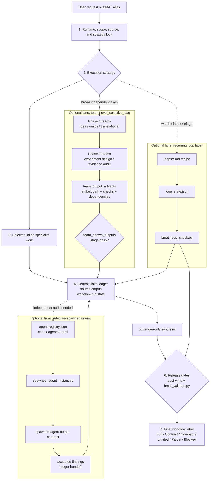

# Biomedical Agent Teams Codex Plugin

Codex Desktop compatible plugin wrapper for the `biomedical-agent-teams` skill.

Current plugin version: `1.0.0`.

## Purpose

BMAT is a lead-controlled biomedical research workflow router for evidence
audit, public-omics analysis, hypothesis tournaments, experiment design,
translational scouting, loop checks, and validator-backed artifact bundles.

Codex loads `skills/biomedical-agent-teams/SKILL.md` as the router. The router
then points to one command recipe at a time, keeping the root prompt small and
making the selected workflow auditable.

## Package Contents

| Resource | Count |
| --- | ---: |
| Agent role prompts | 36 |
| Command recipes | 6 |
| Contract schemas | 17 |
| Templates | 15 |
| Markdown references | 10 |
| JSON references | 1 |
| Loop recipes | 4 |
| Codex reviewer TOML templates | 12 |
| Workflow DAGs | 6 |
| Domain packs | 2 |
| Package scripts | 9 |
| Eval scripts | 3 |

Important files:

- `.codex-plugin/plugin.json`: marketplace metadata and Codex UI description.
- `skills/biomedical-agent-teams/SKILL.md`: lightweight router.
- `skills/biomedical-agent-teams/source-manifest.json`: canonical resource list.
- `skills/biomedical-agent-teams/agent-registry.json`: role metadata and
  spawnable reviewer bindings.
- `skills/biomedical-agent-teams/workflows/*.json`: alias-specific workflow DAGs.
- `skills/biomedical-agent-teams/scripts/bmat_validate.py`: artifact bundle
  schema and policy gate.
- `skills/biomedical-agent-teams/scripts/bmat_run.py`: local runner, DAG
  normalizer, validator wrapper, and Markdown workbench exporter.

## Current Capabilities

- Lazy-loads only the selected workflow recipe and its required resources.
- Records runtime capability, source lock, external-tool authorization,
  reviewer strategy, validator availability, and label ceiling before strong
  workflow claims are made.
- Supports `inline_first_selective_review` and `team_level_selective_dag`.
- Routes substantive public-omics work through `omics-analysis-team` with code,
  provenance, and statistics reviewer floors when runtime support exists.
- Tracks source/result/claim relationships through `results_integration.json`.
- Tracks honest tool use through `tool_call_ledger.json` and
  `bmat_tool_ledger_check.py`.
- Validates artifact labels, source-backed claims, final wording, PMID drift,
  contradiction, overclaim, runtime mismatch, loop state, ranking semantics,
  workflow DAG alias/mode/id consistency, and independent-review evidence.

## Workflow Structure



The lead owns the lock, selected inline work, claim ledger, workflow-run state,
and final synthesis. Optional lanes run only when the execution strategy calls
for them, then hand accepted evidence back to the ledger. Full-protocol release
requires a complete artifact bundle plus passing release gates.

## Full Protocol Bundle

The strongest final label, `Full protocol followed`, requires validator-visible
artifacts:

- `run_state.json`
- `runtime_capability_preflight.json`
- `source_corpus.json`
- `claim_ledger.json`
- `stage_evaluation.json`
- `post_write_validation.json`
- `final.md`

Optional but policy-checked artifacts include:

- `workflow_dag.json`
- `results_integration.json`
- `tool_call_ledger.json`

The validator fails full-protocol claims when required artifacts are missing,
required stages are blocked, post-write validation does not pass, independent
review is not represented by a complete execution record, source-backed claims
do not resolve to included sources, high-confidence final wording drifts from
the ledger, or workflow DAG alias/mode/id fields disagree with the run state.

## Install

Recommended: register the GitHub-hosted marketplace, then install from the
Codex plugin browser:

```bash
codex plugin marketplace add kdh-isaac/BMAT-for-codex --ref main
codex
```

In Codex, open the plugin browser:

```text
/plugins
```

Find **Biomedical Agent Teams** under the
`biomedical-agent-teams-marketplace` marketplace and choose **Install plugin**.

Developer fallback: clone the repository and register the local marketplace
path when testing unpublished changes:

```bash
git clone https://github.com/kdh-isaac/BMAT-for-codex.git
cd BMAT-for-codex
codex plugin marketplace add .
codex
```

Then open `/plugins` and install **Biomedical Agent Teams** from the local
marketplace entry. Restart Codex Desktop if the plugin list does not refresh
immediately.

## Primary Aliases

- `biomedical-research-council`
- `idea-discovery-team`
- `omics-analysis-team`
- `evidence-audit-team`
- `experiment-design-team`
- `translational-scout-team`

Some clients reserve slash-prefixed commands. Use the plain alias form when
that happens.

## Validation

From this plugin root:

```bash
python skills/biomedical-agent-teams/scripts/bmat_package_check.py --root .
python skills/biomedical-agent-teams/scripts/bmat_selftest.py --root .
python skills/biomedical-agent-teams/evals/validate_golden_eval_schema.py --tasks skills/biomedical-agent-teams/evals/golden_tasks.jsonl --outputs skills/biomedical-agent-teams/evals/sample_outputs.jsonl
python skills/biomedical-agent-teams/evals/run_golden_eval.py --tasks skills/biomedical-agent-teams/evals/golden_tasks.jsonl --outputs skills/biomedical-agent-teams/evals/sample_outputs.jsonl --strict --gate
python skills/biomedical-agent-teams/evals/run_model_golden_eval.py --tasks skills/biomedical-agent-teams/evals/golden_tasks.jsonl --alias evidence-audit-team --runtime codex --model sample-model --out bmat_eval_outputs/model-sample.jsonl --sample-mode --then-score --gate
```

When test tooling is available, also run from the marketplace root:

```bash
uvx --with jsonschema pytest tests plugins/biomedical-agent-teams/skills/biomedical-agent-teams/tests -q
```
