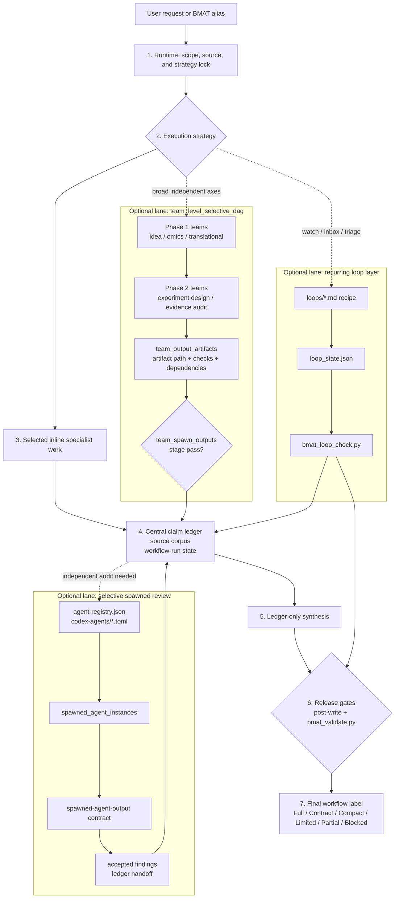

# Biomedical Agent Teams Codex Plugin

Codex Desktop compatible plugin wrapper for the `biomedical-agent-teams` skill.
BMAT is a lead-controlled biomedical research workflow router for evidence
audit, public-omics analysis, hypothesis tournaments, experiment design,
translational scouting, recurring loop checks, and validator-backed artifact
bundles.

## Supported Release

- Current plugin version: `0.8.11`.
- Target runtime: Codex Desktop on macOS and Windows.
- Active router: `skills/biomedical-agent-teams/SKILL.md`.
- Legacy changelog blocks and hard-coded workspace install paths are not part of
  the runtime docs; use git history for older release archaeology.
- Installed cache contents should match this plugin source exactly after
  reinstall; transient test artifacts are intentionally excluded.

## Contents

- `.codex-plugin/plugin.json`: marketplace metadata and Codex UI descriptions.
- `skills/biomedical-agent-teams/`: Codex-native biomedical agent-team skill.
- 36 role prompts, 6 workflow recipes, 14 contract schemas, 14 templates, 10
  references, 4 loop recipes, 12 Codex reviewer templates, and 7 package
  scripts.
- Lightweight router, source manifest, agent registry, fixed-field claim ledger,
  source corpus lock, runtime capability preflight, workflow-run state,
  biomedical passport, stage evaluation, results integration, tool-use honesty
  registry, research overview template, team-DAG output tracking, loop-state
  validation, deterministic validators, and golden eval gates.

## Current Capabilities

- Lazy-loads only the selected workflow recipe and required resources.
- Records runtime capability, source lock, tool-use, reviewer, and validator
  availability before strong workflow labels are used.
- Supports `inline_first_selective_review` and `team_level_selective_dag`
  without requiring all roles to run by default.
- Routes substantive public-omics work through `omics-analysis-team` with code,
  provenance, and statistics reviewer floors when runtime support exists.
- Blocks unsupported citation, PMID drift, contradiction, overclaim, ranking,
  runtime-mismatch, loop-state, and artifact-label claims through tests and
  validators.
- Keeps final synthesis ledger-bound through claim ledger, source corpus,
  results integration, workflow-run state, and meta-review surfaces.
- Enforces full-protocol label honesty by requiring source corpus, claim ledger,
  stage evaluation, post-write validation, and final text artifacts before
  `Full protocol followed` can pass validation.
- Accepts loop connector aliases documented in `loops/*.md`, including
  `Crossref/DOI` and `GEO/SRA/NCBI Datasets`.

## Workflow Structure



The lead owns the lock, selected inline work, claim ledger, workflow-run state,
and final synthesis. Optional lanes run only when the strategy calls for them,
then feed evidence back into the ledger. Full-protocol release requires the
post-write validator and `bmat_validate.py` to pass against a complete artifact
bundle.

## Install

From Windows PowerShell, macOS, or Linux:

```bash
codex plugin marketplace add "<path-to-repo>"
codex plugin add biomedical-agent-teams@biomedical-agent-teams-marketplace
```

Restart Codex Desktop if the plugin list does not refresh immediately.

## Primary Aliases

- `biomedical-research-council`
- `idea-discovery-team`
- `omics-analysis-team`
- `evidence-audit-team`
- `experiment-design-team`
- `translational-scout-team`

Slash-prefixed aliases may be reserved by some Codex clients. If that happens,
use the plain alias form.

## Validation

```bash
python skills/biomedical-agent-teams/scripts/bmat_package_check.py --root .
python skills/biomedical-agent-teams/scripts/bmat_selftest.py --root .
python skills/biomedical-agent-teams/evals/validate_golden_eval_schema.py --tasks skills/biomedical-agent-teams/evals/golden_tasks.jsonl --outputs skills/biomedical-agent-teams/evals/sample_outputs.jsonl
python skills/biomedical-agent-teams/evals/run_golden_eval.py --tasks skills/biomedical-agent-teams/evals/golden_tasks.jsonl --outputs skills/biomedical-agent-teams/evals/sample_outputs.jsonl --strict --gate
```

When test tooling is available, also run:

```bash
uvx --with jsonschema pytest skills/biomedical-agent-teams/tests -q
```
