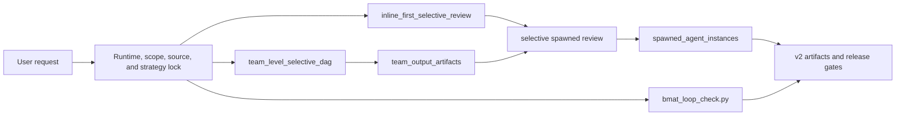

# Biomedical Agent Teams plugin

Codex Desktop wrapper for BMAT v1.2.0. The plugin is a lightweight router plus
auditable command recipes, contracts, specialist prompts, deterministic
checkers, and offline regression cases.

## Runtime entrypoint

Codex loads `skills/biomedical-agent-teams/SKILL.md`. The router selects one
recipe under `commands/` and loads only that recipe's required resources.

| Alias | Route |
| --- | --- |
| `biomedical-research-council` | broad coordination |
| `evidence-audit-team` | source and claim audit |
| `omics-analysis-team` | public omics planning or analysis |
| `idea-discovery-team` | hypothesis tournament |
| `experiment-design-team` | quantitative experiment design |
| `translational-scout-team` | translational and operational scouting |



Important package surfaces:

- `.codex-plugin/plugin.json`: Codex marketplace metadata;
- `skills/biomedical-agent-teams/source-manifest.json`: canonical inventory;
- `skills/biomedical-agent-teams/manifest.json`: versioned resource counts;
- `skills/biomedical-agent-teams/agent-registry.json`: reviewer classes and
  runtime bindings;
- `skills/biomedical-agent-teams/workflows/*.json`: command DAGs;
- `skills/biomedical-agent-teams/contracts/*.json`: Draft 2020-12 artifact
  contracts; and
- `skills/biomedical-agent-teams/scripts/bmat_validate.py`: bundle policy and
  release gate.

## v1.2.0 release contract

Release artifacts use v2 identity fields and bind to one `workflow_run_id` and
plugin version. Source verification records how identity was checked and keeps
fixture/not-checked rows release-ineligible. Claim support points to a
source-owned evidence span, assesses seven scope axes, and records bounded final
wording. Review evidence binds exact inputs, prompt, output, runtime receipt,
and author/reviewer identities. `bundle_manifest.json` closes the bundle by
hashing its release artifacts.

These gates answer different questions:

- schema/policy validation checks implemented process invariants;
- source verification checks identity/version/integrity, not entailment;
- claim-support review checks bounded entailment and scope;
- eligible independent review checks a frozen snapshot through a distinct
  receipt-backed surface; and
- scientific truth still requires external evidence, expertise, statistics,
  and where appropriate experiment or replication.

`same-model-self-review` and `same-model-separate-context` never satisfy the
independent-review gate. Fixture receipts and deterministic sample-model outputs
test plumbing only.

## Local runner

From this plugin directory:

```bash
python skills/biomedical-agent-teams/scripts/bmat_run.py --alias evidence-audit-team --mode standard --tier compact --question "Audit the evidence for this bounded claim" --out outputs/bmat-audit --domain-pack generic-biomedical --dry-run
```

Scaffolds are intentionally incomplete and cannot claim a full-protocol
release. Populate real evidence and receipts, generate the bundle manifest, and
then run `bmat_validate.py --release`.

## Validation

```bash
python skills/biomedical-agent-teams/scripts/bmat_package_check.py --root .
python skills/biomedical-agent-teams/scripts/bmat_selftest.py --root .
python skills/biomedical-agent-teams/evals/validate_golden_eval_schema.py --tasks skills/biomedical-agent-teams/evals/golden_tasks.jsonl --outputs skills/biomedical-agent-teams/evals/sample_outputs.jsonl
python skills/biomedical-agent-teams/evals/run_golden_eval.py --tasks skills/biomedical-agent-teams/evals/golden_tasks.jsonl --outputs skills/biomedical-agent-teams/evals/sample_outputs.jsonl --strict --gate
python skills/biomedical-agent-teams/scripts/bmat_validate.py --bundle skills/biomedical-agent-teams/tests/fixtures/valid_full_protocol_bundle --release
python -B -m pytest -p no:cacheprovider ../../tests skills/biomedical-agent-teams/tests -q
```

The supported release matrix is Python 3.10-3.13. The public-omics smoke is
metadata-only and downloads no raw data. CI uses deterministic `--sample-mode`;
live model evaluation requires an explicit adapter command.

See the repository-level
[validation boundaries](../../docs/validation-boundaries.md),
[migration guide](../../docs/migration-v1-to-v2.md), and
[release checklist](../../docs/release-checklist.md).

## Safety floor

- Keep raw data read-only and private/controlled data local.
- Do not fabricate citations, identifiers, tool calls, reviewer identities, or
  validation status.
- Preserve negative evidence, contradictions, limitations, and structured skip
  reasons.
- Treat BMAT output as research support, not patient-facing advice or
  regulatory approval.
