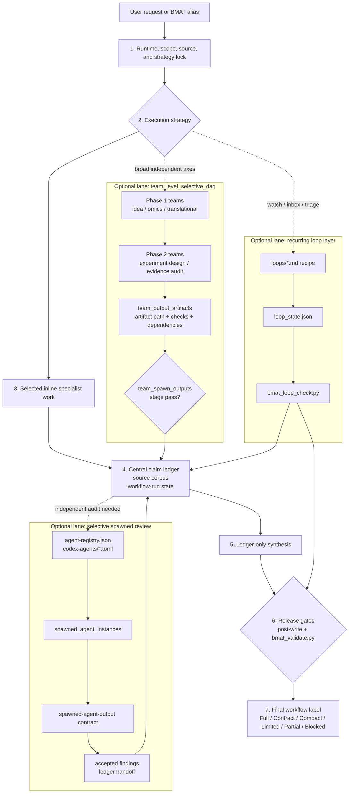

# Biomedical Agent Teams

Codex biomedical agent-team bundle with a lightweight router, protocol lock,
central claim ledger, source corpus, runtime capability preflight, audit gates,
writer restriction, post-write final validation, loop-state resources,
tool-use/result integration, research overview synthesis, team output artifact
tracking, and optional deterministic artifact validators.

Codex uses `SKILL.md` as the router and treats `agents/*.md` as role prompts.
Long governance instructions live in command recipes, references, templates,
contracts, and scripts that are lazy-loaded only when needed.

## Supported Release

- Current version: `0.8.4`.
- Runtime target: Codex Desktop on macOS and Windows.
- Legacy version history is intentionally excluded from this runtime README.
  Use git history for old release notes.
- The package is contract-described by default. Strong workflow labels require
  the matching artifacts, source locks, reviewer/tool evidence, and validator
  results.

## Current Resource Surface

- 36 agent prompts in `agents/`.
- 6 workflow recipes in `commands/`.
- 14 contract schemas in `contracts/`.
- 14 templates in `templates/`.
- 10 references in `references/`.
- 4 recurring-loop recipes in `loops/`.
- 12 Codex reviewer templates in `codex-agents/`.
- 7 scripts for docs inventory, package checks, artifact scaffolding, loop
  checks, validation, Elo aggregation, self-tests, and golden eval scoring.

## Current Capabilities

- Lazy-loads the selected workflow recipe instead of loading every role.
- Records runtime capability, source lock, external-tool authorization,
  validator availability, reviewer strategy, and final label ceiling before
  strong claims are made.
- Supports `inline_first_selective_review` and `team_level_selective_dag` with
  explicit handoff contracts and dependency checks.
- Routes substantive public-omics work through `omics-analysis-team` and applies
  code, provenance, and statistics reviewer floors when runtime support exists.
- Tracks tool use and results through `references/tool-registry.md` and
  `contracts/results-integration.schema.json`.
- Supports hypothesis tournaments with iteration budget, meta-review,
  prioritization-only Elo/ranking semantics, and stop-criterion checks.
- Validates loop state, artifact labels, source-backed claims, final wording,
  PMID drift, contradiction, overclaim, runtime mismatch, and ranking honesty.

## Workflow Structure



The main workflow progresses vertically from request lock to final label. The
lead owns the lock, selected inline work, claim ledger, workflow-run state, and
final synthesis. Optional lanes run only when the strategy calls for them, then
feed evidence back into the ledger: team DAG outputs are proven by
`team_output_artifacts`, reviewer execution is proven by
`spawned_agent_instances`, and recurring loops are checked by
`bmat_loop_check.py`.

## Included Commands

- `biomedical-research-council`: broad mechanism, evidence, omics, design, and
  writing coordination.
- `idea-discovery-team`: hypothesis generation, tournament ranking, red-team
  critique, and experimental planning.
- `omics-analysis-team`: public-omics dataset curation, analysis planning or
  execution, review gates, and provenance reporting.
- `evidence-audit-team`: claim-level evidence, citation, provenance,
  statistics, contradiction, and safer wording audit.
- `experiment-design-team`: mechanistic validation, controls, sample-size
  logic, protocol logistics, and decision gates.
- `translational-scout-team`: trial landscape, operational feasibility,
  safety/regulatory flags, IP, and competitive positioning.

## Included Agents

- `life-science-lead-scientist`
- `protocol-context-locker`
- `entity-normalizer`
- `central-claim-ledger-evidence-graph`
- `life-science-literature-curator`
- `scientific-literature-researcher`
- `public-omics-analyst`
- `immunology-mechanism-critic`
- `hypothesis-generator`
- `hypothesis-ranker`
- `meta-review-synthesizer`
- `contradiction-red-team`
- `experimental-design-planner`
- `citation-verifier`
- `scientific-writer-citation-agent`
- `omics-data-curator`
- `omics-code-reviewer`
- `bulk-deg-analyst`
- `scrna-qc-specialist`
- `pathway-interpreter`
- `biostats-repro-auditor`
- `omics-provenance-validator`
- `omics-reporter`
- `scenario-playbook-router`
- `claim-level-evidence-verifier`
- `causal-inference-confounder-analyst`
- `risk-of-bias-study-quality-auditor`
- `safety-ethics-privacy-dual-use-auditor`
- `bayesian-decision-modeler`
- `clinical-trial-operations-scout`
- `grant-ip-landscape-scout`
- `protocol-reagent-logistics-planner`
- `provenance-traceability-architect`
- `figure-schematic-director`
- `model-card-dataset-card-writer`
- `post-write-final-validator`

## Validation

From `skills/biomedical-agent-teams/`:

```bash
python scripts/bmat_package_check.py --root ../..
python scripts/bmat_selftest.py --root ../..
python evals/validate_golden_eval_schema.py --tasks evals/golden_tasks.jsonl --outputs evals/sample_outputs.jsonl
python evals/run_golden_eval.py --tasks evals/golden_tasks.jsonl --outputs evals/sample_outputs.jsonl --strict --gate
python -m pytest tests -q
```

## Safety Boundaries

- Treat raw data as read-only.
- Do not upload private data, PHI/PII, unpublished project text, or
  patent-sensitive details.
- Do not fabricate PMIDs, DOIs, accessions, reagent details, database records,
  tool use, reviewer use, or validation results.
- Separate evidence, inference, hypothesis, and speculation.
- Keep public-omics proxy evidence separate from CAR-T-intrinsic mechanism
  claims unless the design supports that inference.
