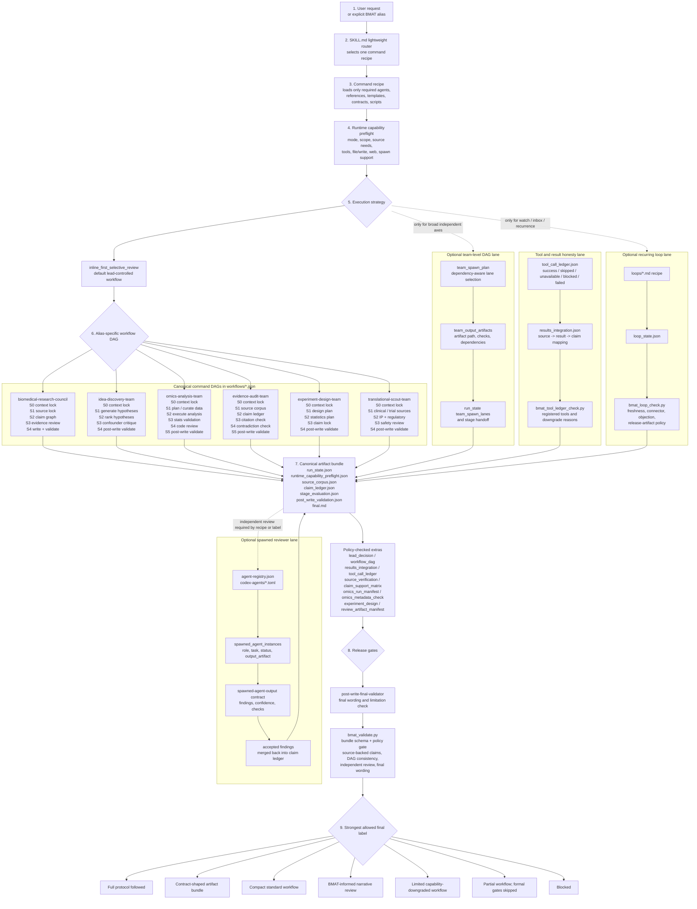
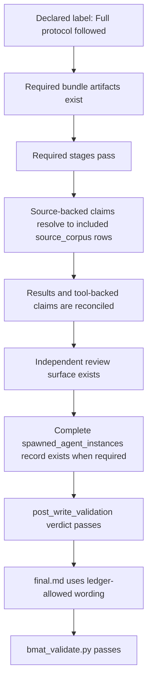

# Biomedical Agent Teams

Current version: `1.1.0`.

Codex biomedical agent-team bundle with a lightweight router, protocol and
runtime lock, source corpus, central claim ledger, results integration,
tool-ledger honesty checks, workflow DAGs, loop-state resources, post-write
validation, and deterministic release gates.

Codex uses `SKILL.md` as the router and treats `agents/*.md` as role prompts.
Long governance instructions live in command recipes, references, templates,
contracts, and scripts that are lazy-loaded only when needed.

## 1.1.0 Resource Surface

| Resource | Count |
| --- | ---: |
| Agent role prompts in `agents/` | 38 |
| Workflow recipes in `commands/` | 6 |
| Contract schemas in `contracts/` | 23 |
| Templates in `templates/` | 21 |
| Markdown references in `references/` | 10 |
| JSON references in `references/` | 1 |
| Loop recipes in `loops/` | 4 |
| Codex reviewer TOML templates in `codex-agents/` | 14 |
| Workflow DAGs in `workflows/` | 6 |
| Domain packs in `domain-packs/` | 3 |
| Package scripts in `scripts/` | 14 |
| Eval scripts in `evals/` | 3 |
| Public omics benchmark cases in `evals/` | 9 |

## 1.1.0 Highlights

- `runtime_capability_preflight.json` is the canonical runtime capability
  preflight artifact.
- `lead_decision.json` is the auditable lead-scientist routing artifact for
  source-backed `standard`, `deep`, `audit`, team-DAG, and full-protocol runs.
- `omics_run_manifest.json` uses the v2 10x/bulk contract for Cell Ranger,
  matrix, doublet/ambient, pseudobulk, bulk reference, design, and DE provenance.
- `results_integration.json` maps sources, tools, reviewer outputs, omics
  outputs, and literature outputs back to claim rows.
- `source_verification.json` records source/source-span checks, while
  `claim_support_matrix.json` records high-confidence, tool-backed,
  analysis-backed, and blocked-claim support decisions.
- `omics_metadata_check.json`, `experiment_design.json`, and
  `review_artifact_manifest.json` provide release-checkable metadata,
  experimental design, and SHA-256-bound review artifact surfaces.
- `tool_call_ledger.json` records successful, skipped, blocked, failed, or
  unavailable tool calls.
- `workflow_dag.json` records alias-specific execution structure; the runner
  normalizes DAG `mode` and `workflow_id` to the requested run mode.
- `bmat_validate.py` enforces bundle shape, source-backed claim references,
  final wording, post-write verdict, independent review evidence, S3/high
  confidence gates, team DAG contracts, tool-ledger policy, workflow DAG
  alias/mode/id consistency, and release-mode source/support/artifact gates.
- `bmat_run.py` creates local dry-run bundles, supports `--tier compact|full`
  and `--track bulk-rnaseq|tenx-*|single-cell-other|survival|multi-omics`,
  writes workflow DAGs, runs validator/tool-ledger checks, and can export a
  Markdown workbench.
- `bmat_codex_adapter.py` scaffolds a local Codex orchestration bundle and
  validates collected artifacts.
- `bmat_public_omics_benchmark_smoke.py` runs metadata-only public benchmark
  smokes for 10x PBMC, GEO single-cell/CellPlex, bulk RNA-seq, CITE-seq,
  V(D)J, and multiome cases without downloading raw data.
- Golden eval gates cover PMID drift, contradiction, overclaim,
  tournament-loop, tournament-ranking, Codex-runtime, semantic-scope, 10x/bulk
  omics provenance, privacy/runtime, and expected-block behavior.
- Runtime documentation keeps only the current release surface; older release
  archaeology belongs in git history.

## Workflow Structure



The main workflow progresses from router selection to a validator-backed label.
The lead owns the router decision, runtime preflight, selected command DAG,
central claim ledger, artifact bundle, and final synthesis. Team, reviewer,
tool/result, and recurring-loop lanes run only when the selected recipe,
execution strategy, risk class, or requested label requires them. Team outputs
are proven by `team_output_artifacts`, reviewer execution is proven by
`spawned_agent_instances`, tool/result claims are reconciled through
`tool_call_ledger.json` and `results_integration.json`, and recurring loops are
checked by `bmat_loop_check.py`.

## Full Protocol Structure



Required full-protocol artifacts:

- `run_state.json`
- `runtime_capability_preflight.json`
- `lead_decision.json`
- `source_corpus.json`
- `claim_ledger.json`
- `stage_evaluation.json`
- `post_write_validation.json`
- `final.md`

Optional but policy-checked artifacts:

- `workflow_dag.json`
- `results_integration.json`
- `tool_call_ledger.json`
- `omics_run_manifest.json`
- `source_verification.json`
- `claim_support_matrix.json`
- `omics_metadata_check.json`
- `experiment_design.json`
- `review_artifact_manifest.json`

Release-bound validation should use `scripts/bmat_validate.py --release`.
Release mode fails if `jsonschema` is unavailable, high-confidence claims lack
support rows, source-backed claims cannot be verified, review artifact hashes
drift, or sample-mode golden eval output is presented as live model evidence.

## Included Commands

- `biomedical-research-council`: broad mechanism, evidence, omics, design, and
  writing coordination.
- `idea-discovery-team`: hypothesis generation, tournament ranking, red-team
  critique, and experimental planning.
- `omics-analysis-team`: public-omics dataset curation, analysis planning or
  execution, review gates, and provenance reporting.
- `evidence-audit-team`: claim-level evidence, citation, provenance,
  statistics, contradiction, and safer wording audit.
- `experiment-design-team`: mechanistic validation, controls, sample-size
  logic, protocol logistics, and decision gates.
- `translational-scout-team`: trial landscape, operational feasibility,
  safety/regulatory flags, IP, and competitive positioning.

## Included Agents

- `life-science-lead-scientist`
- `protocol-context-locker`
- `entity-normalizer`
- `central-claim-ledger-evidence-graph`
- `life-science-literature-curator`
- `scientific-literature-researcher`
- `public-omics-analyst`
- `immunology-mechanism-critic`
- `hypothesis-generator`
- `hypothesis-ranker`
- `meta-review-synthesizer`
- `contradiction-red-team`
- `experimental-design-planner`
- `citation-verifier`
- `scientific-writer-citation-agent`
- `omics-data-curator`
- `omics-code-reviewer`
- `bulk-deg-analyst`
- `scrna-qc-specialist`
- `pathway-interpreter`
- `biostats-repro-auditor`
- `omics-provenance-validator`
- `omics-reporter`
- `scenario-playbook-router`
- `claim-level-evidence-verifier`
- `causal-inference-confounder-analyst`
- `risk-of-bias-study-quality-auditor`
- `safety-ethics-privacy-dual-use-auditor`
- `bayesian-decision-modeler`
- `clinical-trial-operations-scout`
- `grant-ip-landscape-scout`
- `protocol-reagent-logistics-planner`
- `provenance-traceability-architect`
- `figure-schematic-director`
- `model-card-dataset-card-writer`
- `post-write-final-validator`

## Validation

From `skills/biomedical-agent-teams/`:

```bash
python scripts/bmat_package_check.py --root ../..
python scripts/bmat_selftest.py --root ../..
python evals/validate_golden_eval_schema.py --tasks evals/golden_tasks.jsonl --outputs evals/sample_outputs.jsonl
python evals/run_golden_eval.py --tasks evals/golden_tasks.jsonl --outputs evals/sample_outputs.jsonl --strict --gate
python evals/run_model_golden_eval.py --tasks evals/golden_tasks.jsonl --alias evidence-audit-team --runtime codex --model sample-model --out bmat_eval_outputs/model-sample.jsonl --sample-mode --then-score --gate
python scripts/bmat_public_omics_benchmark_smoke.py --out bmat_eval_outputs/public-omics-benchmark --validate --force
uvx --with jsonschema pytest tests -q
```

## Safety Boundaries

- Treat raw data as read-only.
- Do not upload private data, PHI/PII, unpublished project text, or
  patent-sensitive details.
- Do not fabricate PMIDs, DOIs, accessions, reagent details, database records,
  tool use, reviewer use, or validation results.
- Separate evidence, inference, hypothesis, and speculation.
- Keep public-omics proxy evidence separate from CAR-T-intrinsic mechanism
  claims unless the design supports that inference.
