# Biomedical Agent Teams skill

BMAT v1.2.0 is a Codex-native biomedical workflow router. `SKILL.md` selects
one command recipe; the recipe loads only its required agents, references,
contracts, templates, scripts, domain pack, and workflow DAG.

## Package map

| Path | Purpose |
| --- | --- |
| `commands/` | Six top-level workflow recipes |
| `agents/` | Specialist role instructions |
| `codex-agents/` | Spawnable reviewer templates |
| `contracts/` | JSON Schema Draft 2020-12 artifact contracts |
| `workflows/` | Alias-specific DAGs and release outputs |
| `domain-packs/` | Generic biomedical, cell-therapy, and immuno-oncology overlays |
| `templates/` | Human-readable artifact templates |
| `scripts/` | Dependency-light runners, generators, and validators |
| `evals/` | Offline golden tasks and metadata-only public-omics cases |
| `tests/` | Unit, policy, fixture, migration, and release-surface regression tests |

Use `source-manifest.json` as the canonical inventory. `manifest.json` carries
machine-checked counts; README counts are intentionally not authoritative.

## Runtime flow

```mermaid
flowchart LR
    request["Bounded user request"] --> router["SKILL.md router"]
    router --> recipe["One command recipe"]
    recipe --> preflight["Runtime, scope, source, domain-pack lock"]
    preflight --> dag["Inline or selective team DAG"]
    dag --> artifacts["v2 workflow artifacts"]
    artifacts --> checks["Source, claim, design, tournament, review checks"]
    checks --> manifest["Hash-bound bundle manifest"]
    manifest --> validator["bmat_validate.py --release"]
    validator --> label["Ledger-derived final label"]
```



The six aliases are `biomedical-research-council`, `evidence-audit-team`,
`omics-analysis-team`, `idea-discovery-team`, `experiment-design-team`, and
`translational-scout-team`.

## v2 evidence and review spine

Release-bound source-backed claims require all of the following:

1. an included source-corpus row with a source-owned evidence span;
2. a source-verification row that records the exact verification mode,
   identity, version/integrity state, and receipt or local snapshot hash;
3. a claim-ledger row bound to that source;
4. a claim-support row bound to the evidence span with species, cell type,
   assay, endpoint, population/model, intervention/exposure, and biological
   context scope judgments;
5. results/tool integration when an execution surface produced or changed the
   claim; and
6. eligible review receipts when the risk class or full-protocol label requires
   independence.

`fixture` and `not-checked` verification are always release-ineligible. A tool
success establishes execution, not entailment. Source identity and claim
support are separate checks.

Review classes are `same-model-self-review`,
`same-model-separate-context`, `separate-model`, `external-tool`, and `human`.
Only the last three can be independent-review eligible, and only with a valid
runtime receipt plus exact input, prompt, output, and receipt hashes. A role
name, new task, or spawn event alone does not establish independence.

## Process-versus-truth boundary

The release validator checks implemented process invariants: schema shape,
cross-artifact identity, local path confinement, file hashes, structured skip
reasons, source/support linkage, review eligibility, workflow policy, and final
label consistency. It does not certify scientific truth, experimental
reproducibility, causal validity, clinical utility, or regulatory compliance.

Report these layers separately:

- process/contract status;
- source-identity status;
- claim-entailment and scope status;
- independent-review class and receipt status; and
- unresolved scientific uncertainty.

Sample-mode golden evaluation is deterministic evaluator plumbing, not live
model performance. Public-omics smoke cases are metadata-only and download no
raw data. Checked-in fixtures prove regression wiring, not real evidence.

## Core CLI surfaces

Initialize or run a conservative scaffold:

```bash
python scripts/bmat_run.py --alias evidence-audit-team --mode standard --tier compact --question "Audit this claim" --out outputs/bmat-audit --domain-pack generic-biomedical --dry-run
```

Validate explicit source receipts and claim support:

```bash
python scripts/bmat_source_check.py --source-corpus outputs/bmat-audit/source_corpus.json --claim-ledger outputs/bmat-audit/claim_ledger.json --tool-call-ledger outputs/bmat-audit/tool_call_ledger.json --verification-input outputs/bmat-audit/source_verification.json --bundle-root outputs/bmat-audit --out outputs/bmat-audit/source_verification.json
python scripts/bmat_claim_support_check.py --bundle outputs/bmat-audit --release
```

Close and validate a completed release bundle:

```bash
python scripts/bmat_bundle_manifest.py --bundle outputs/bmat-audit
python scripts/bmat_validate.py --bundle outputs/bmat-audit --release
```

Migrate a legacy bundle without changing it:

```bash
python scripts/bmat_migrate_bundle.py --source examples/bundle-v1 --out outputs/bundle-v2
```

Migration is structural only. Missing or fixture verification stays
not-checked/release-ineligible, unavailable reviewer identity stays
non-independent, and unresolved evidence is emitted for re-verification.

## Package validation

From the repository root:

```bash
python plugins/biomedical-agent-teams/skills/biomedical-agent-teams/scripts/bmat_package_check.py --root plugins/biomedical-agent-teams
python plugins/biomedical-agent-teams/skills/biomedical-agent-teams/scripts/bmat_selftest.py --root plugins/biomedical-agent-teams
python plugins/biomedical-agent-teams/skills/biomedical-agent-teams/evals/validate_golden_eval_schema.py --tasks plugins/biomedical-agent-teams/skills/biomedical-agent-teams/evals/golden_tasks.jsonl --outputs plugins/biomedical-agent-teams/skills/biomedical-agent-teams/evals/sample_outputs.jsonl
python plugins/biomedical-agent-teams/skills/biomedical-agent-teams/evals/run_golden_eval.py --tasks plugins/biomedical-agent-teams/skills/biomedical-agent-teams/evals/golden_tasks.jsonl --outputs plugins/biomedical-agent-teams/skills/biomedical-agent-teams/evals/sample_outputs.jsonl --strict --gate
python plugins/biomedical-agent-teams/skills/biomedical-agent-teams/scripts/bmat_public_omics_benchmark_smoke.py --out outputs/bmat-public-omics --validate --force
python -B -m pytest -p no:cacheprovider tests plugins/biomedical-agent-teams/skills/biomedical-agent-teams/tests -q
```

Supported release Python versions are 3.10-3.13. CI uses only offline/synthetic
test content after installing dependencies; live source resolution, live model
execution, raw-data download, and private-data transmission are out of scope.

See the repository-level validation boundaries, v1-to-v2 migration guide, and
clean-checkout release checklist under `docs/`.

## Safety

- Keep raw and controlled data read-only and local unless explicitly approved.
- Never fabricate identifiers, source checks, tool calls, reviewer identity,
  hashes, or validation results.
- Preserve contradictions, negative findings, exclusions, and limitations.
- Treat clinical outputs as research support requiring clinician review.
